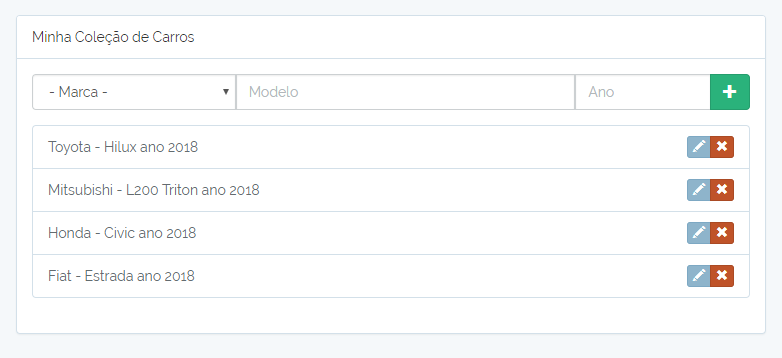

# Teste desenvolvedor do Estadão

## O Teste
Apesar de se tratar de um CRUD simples, tentei dar atenção aos detalhes para que dessa maneira consiga entregar um resultado acima do esperado. Espero sinceramente que esteja aceitável pois atende a maior parte de tudo que foi proposto.

#### Backend
* **PHP Framework** - Para o Backend da aplicação escolhi o Laravel 5.5 como Framework PHP.
* **API** - A API contém o model Carro e Marcas. Ambos estão relacionados. A rotas disponíveis são as seguintes:

  + `/carros` - [GET] retorna todos os carros cadastrados.
  + `/carros` - [POST] cadastra um novo carro.
  + `/carros/{id}` [GET] retorna o carro com ID especificado.
  + `/carros/{id}` [PUT] Atualiza os dados do carro com ID especificado.
  + `/carros/{id}` [DELETE] Exclui o carro com ID especificado.

Controller disponível em `app/Controllers/CarroController.php` e Model na pasta `app/Carro.php` e `app/Marca.php`. Não criei um controller para a model Marcas pois não achei nescessário.

Para conferir pode rodar o comando `php artisan route:list` após a instalação ou conferir no arquivo `routes/api.php`.

* **Banco de dados** - Escolhi o SQLite principalmente por ser um banco que grava os dados em um arquivo dentro na própria aplicação, não sendo nescessário ter o MySQL instalado para testar a aplicação. Em produção utilizaria MySQL.

* **Validação de Dados** - Mesmo se tratando de um crud simples, implementei a validação de dados na API e no Front End são exibidas mensagens de validação ao tentar inserir ou editar registros.

* **Testes** - Foram criados alguns testes bem simples a título de exemplo. Para rodar os testes basta usar o comando `composer test` no terminal. O código pode ser visto na pasta `/tests`.

#### Front-End
* As funcionalidades do Front-End foram desenvolvidas conforme solicitado, sendo possíel:

  + Ver a lista de carros cadastrados
  + Criar um novo carro
  + Editar um carro existente
  + Apagar um carro existente

Todas estas ações estão em uma Single Page Aplication responsiva que funciona 100% via chamadas AJAX contendo ainda um select populado com algumas marcas de carro.

* **JavaScript Framework** - Optei por desenvolver o Front-end em **Vue.js**. O código escrito em JavaScript puro encontra-se na pasta `resurces/assets/js`

* **Pacotes extras** Utilizei o Axios para fazer as requisições HTTP na API e utilizei também o SweetAlert 2 para criar o alert de confirmação de exclusão.

* **Bootstrap** - O Boostrap foi utilizado como Framework HTML/CSS, conferindo um visual razoavelmente aceitável para uma aplicação simples e também já facilitando bastante o trabalho de deixar tudo responsivo.

* **Validação** São exibidas mensagens informando ao usuário sobre erros nos prenchimento do formulário.

* **Testes** - Também foi criado um teste bem simples a título de exemplo no JavaScript. Para rodar os testes basta usar o comando `npm test` no terminal. O código pode ser visto na pasta `/tests/JavaScript`.

## Instruções de funcionamento
Segue abaixo as instruções básicas para executar o projeto e em caso de dúvidas sinta-se a vontade para entrar em contato: <lucianobragaweb@gmail.com>

### Pré Requisitos
* PHP >= 7.0.0
* Composer
* Node.js

#### Instalando e Testando

Rodar os seguintes comandos no terminal

`npm install` Instala os pacotes do Node.js

`npm run dev` Roda aplicação Front-End - Este comando é opcional, já que os arquivos compilados se encontram na pasta `/public`

`composer install` Instala o Laravel e suas dependências

`php artisan migrate` Cria as tabelas no banco de dados SQLite

`php artisan db:seed` Popula o banco com uma massa inicial de dados

`php artisan serve` Inicia o servidor PHP

### Outros Comandos Disponíveis
* `php artisan route:list` Lista as rotas Disponíveis
* `composer test` Roda os testes PHP
* `npm test` Roda os testes JavaScript

## Considerações/Observações
* Docker: Eu gostaria de ter utilizado o Docker e isso facilitaria bastante inclusive a parte de execução do projeto. Mas infelizmente Windows 7 e o Docker Toolbox se recusaram a trabalhar juntos :(

> *Nota* - Sim, eu sei que não é uma boa prática versionar o `.env` e o banco, mesmo sendo um `database.sqlite` vazio. Fiz isso apenas pra facilitar na hora de rodar a aplicação.  
